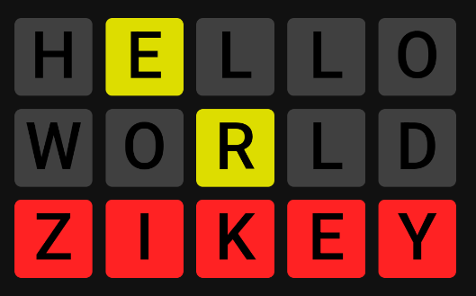

# ZK-Wordle

Zero-knowledge wordle game which protects players from dishonest servers.

* At the beginning of the game, server commits to the secret word and can't change it during the gameplay
* After each guess, the server proves that the returned clue really matches the guess and the secret word

Server implemented in `Rust`, frontend app in `Typescript`, ZK stuff using `circom`, `snarkjs`, and `arkworks/circom-compat`.

<p align="center">
  
</p>

## Running the honest & loyal server

Just hit
```
cargo run --release
```
in the `server` directory. Recommended to use env `RUST_LOG=info,wasmer_compiler_cranelift=warn` to see the meaningful logs, but hide some spammy library logs. After you see logs like these...
```
[2024-06-23T17:29:38Z INFO  server::game_state] Creating initial game state...
[2024-06-23T17:29:39Z INFO  server::http_service] Starting server...
```
...the server should be ready to respond to client's requests. You can verify the server working by example curls:
```
curl http://localhost:4000/start
```
or
```
curl http://localhost:4000/guess -H 'Content-Type: application/json' -d '{"word_id": 0, "guess": "hello"}'
```

## Frontend

We have da frontend application in the `front` directory.

## Circuits

`proof-clue` and `proof-membership` contain circuit descriptions in `*.circom` files. The data generated from them is already in the repository (in `proof-clue, proof-membership, keys` directories), so that this project can be easily run, but if you want fresh keys, you can generate them using `powersoftau` and `snarkjs` from compiled circuits.

To compile the circuits again, you need to `mkdir circomlib` in the root directory of the project, download `circuits/poseidon.circom, circuits/poseidon_constants.circom` from circomlib: https://github.com/iden3/circomlib, put them in the created directory, and then you should be able to compile them using `circom`.